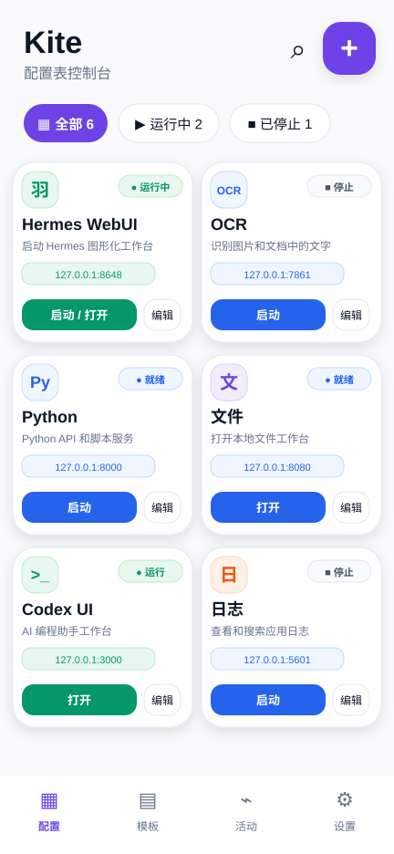

# Kite

Kite 是一个面向 Android 的 KF/RKF 操作层。它把 KF/KFShell 这类移动 Linux 与 AI 运行底座包装成卡片、终端、浏览器工作台和可分享工作流，让手机上的 Ubuntu/proot 服务不再只是一堆命令和端口。

一句话说，Kite 拿 KF 作为内核，把“启动工具、等待服务、打开页面、看日志、做账号验证、回到工作台”这些动作卡片化。



## 它解决什么

KF/KFShell 负责真正的执行环境：Ubuntu rootfs、PRoot、进程管理、工具链、服务端口、终端、日志和运行时生命周期。Kite 负责把这些能力变成用户和 AI 都容易操作的入口：

- 把一个服务或脚本做成 Kite Card。
- 点击卡片后在 KF runtime 中执行命令、安装依赖或启动服务。
- 等待服务端口就绪后打开对应的本地 Web 工作台。
- 用内置 Web Shell 承接 `127.0.0.1` / `localhost` 页面，减少 Ubuntu 内部没有浏览器带来的麻烦。
- 把外部登录、OAuth、账号验证、浏览器回跳这类事情交给 Android 系统浏览器或 Kite Web Shell 协作处理。
- 让卡片可以本地导入、导出、分享，后续也可以从网络加载。

Kite 的目标不是做另一个完整浏览器，也不是把 KF 重新写一遍。它更像 KF 的手机工作台外壳：KF 管执行，Kite 管入口、呈现、诊断和工作流身份。

## 核心概念

### Kite Card

Kite Card 是一个可执行的工作流入口。它可以只是打开一个网址，也可以先执行脚本，再等待结果，再打开 Web 页面。

常见卡片类型：

- 服务卡片：启动 Hermes WebUI、Codex WebUI、文件服务、Python/Node Web 服务等。
- 安装卡片：一键安装 Android/AI 开发环境、Node、pnpm、uv、adb/fastboot 等依赖。
- 命令卡片：执行一个 KF/Ubuntu 命令，读取结构化运行报告。
- Web 卡片：直接打开本地或外部工作台。

卡片不只是 UI 数据。它同时是快捷入口、任务身份、运行报告绑定对象、默认工作台地址和分享单元。

### Kite Recipe

Kite Recipe 是卡片背后的 JSON 工作流协议。一个 Recipe 可以描述：

- 卡片名称、图标、分类和说明。
- 默认打开地址，例如 `http://127.0.0.1:8648`。
- shell / service / open_web 等步骤。
- 成功判断、最后有效输出、运行报告摘要。
- 是否允许作为桌面快捷入口。

Recipe 的执行边界很重要：Recipe 可以描述要做什么，但传输方式、token、KF 启动方式和最终执行权不交给 Recipe 决定。Android/KF runtime 才是执行所有 shell、PRoot、进程、服务和资源管理动作的控制面。

### Kite Web Shell

Kite Web Shell 是一个偏“无头”的内置浏览器壳。它不是给普通网页浏览设计的，所以不会追求完整地址栏、书签、历史、复杂标签页和下载器体验。

它更关注这些事：

- 打开本地服务页面，例如 `http://127.0.0.1:*` 和 `http://localhost:*`。
- 捕获 WebView console、页面错误、加载状态和能力报告。
- 为本地 AI Web 应用提供稳定的 Android WebView 容器。
- 外部站点和公网登录默认跳系统浏览器。
- 为 Codex、抖音账号、OAuth、CLI 回调等登录/验证流程提供移动端承接点。

长期方向上，Kite Web Shell 会尽量让网页元素、错误、状态和上下文对 AI 更友好，也就是一种更适合 AI 使用和诊断的浏览器工作面。

### 桌面快捷方式

Kite Card 的目标形态是可以变成 Android 桌面快捷方式。用户点桌面图标时，不必先进入 Kite 本体再找功能，而是直接进入这个卡片对应的工作台：

```text
桌面快捷方式
-> Kite Card / Recipe
-> KF runtime 执行脚本或启动服务
-> 等待端口 / 读取 Run Report
-> 打开 Kite Web Shell 或系统浏览器
```

当前代码已经保留了 `shortcut` 语义和卡片身份，桌面快捷入口仍在持续完善中。

## 当前仓库包含什么

这个仓库不是一个纯 UI demo。当前主线已经包含：

- Android app 工程。
- Kite Console / Recipe 卡片界面。
- Kite Web Shell。
- Kite Bridge Client 和本地运行报告处理。
- Kite Recipe loader、drop zone 导入和共享卡片目录。
- KF/KFShell runtime 相关代码。
- Ubuntu rootfs、PRoot 运行资产、AI 开发工具链离线包。
- Termux terminal view 本地集成。
- Shizuku、ADB、PRoot、runtime lifecycle、task/status/logs 等运行时模块。

其中大体分工是：

```text
Kite
  卡片、Recipe、Web Shell、诊断、导入/分享、工作台入口。

Android/KF runtime
  PRoot、Ubuntu、终端、进程、工具链、服务、日志、资源与生命周期管理。

Recipe / Card
  描述工作流和默认工作台，但不拥有平台传输层和敏感执行权限。
```

## 卡片分享和导入

Kite 预期支持多种卡片来源：

- 内置卡片：随 APK 打包，适合官方维护的常用工作流。
- 本地卡片：用户自己创建和编辑。
- 导入卡片：从共享目录导入。
- 网络卡片：未来从远端加载。

当前代码中，drop zone 会准备共享目录并扫描 JSON Recipe。复杂卡片可以把脚本逻辑放进包内，Kite 读取 `recipe.json` 后生成卡片，再由 KF runtime 负责执行。

## 安全边界

Kite 面向个人设备和本地运行环境，不应该把控制接口暴露给不可信网络。

当前设计原则：

- 本地服务默认绑定 `127.0.0.1` / `localhost`。
- Recipe 不允许决定 bridge 地址、token、KF 包名或传输方式。
- 会触发 shell、PRoot、ADB、进程管理或安装动作的能力必须由 Android/KF 控制面接管。
- 第三方卡片和脚本包需要来源可信，后续应加入更明确的风险提示和签名/权限模型。
- Kite Web Shell 主要承接本地工作台；外部登录和公网链接优先交给系统浏览器。

## 构建

Windows / PowerShell：

```powershell
.\gradlew.bat assembleDebug
```

主要工程入口：

- Android app: `app/`
- 内置 Recipe: `app/src/main/assets/recipes/`
- 外部运行资产: `assets/`
- 协议文档: `docs/protocol/`
- 架构文档: `docs/architecture/`

## 许可证

Kite 原创代码、文档、Recipe 和集成工作默认使用 PolyForm Noncommercial License 1.0.0，个人、研究、教育、非营利等非商业用途可以使用，商业用途需要单独授权。

仓库中包含 Ubuntu、Node.js、pnpm、uv、PRoot、Termux/TerminalView、AndroidX、Shizuku 等第三方组件或二进制资产。这些内容不被 Kite 的不可商用许可证重新授权，仍按各自上游许可证和分发条款使用。详情见 `LICENSE` 和 `THIRD_PARTY_NOTICES.md`。
