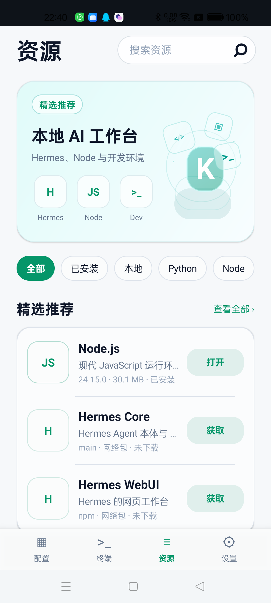
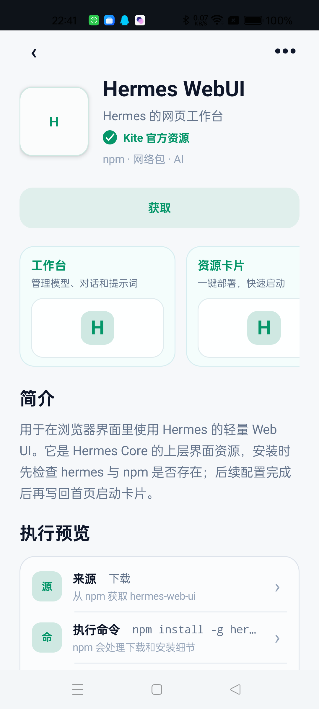
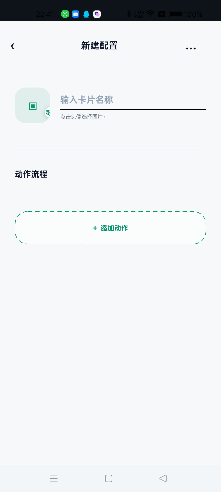
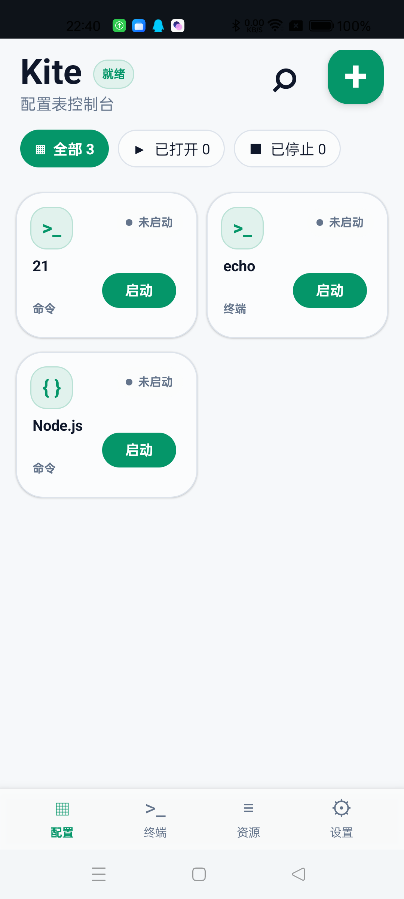
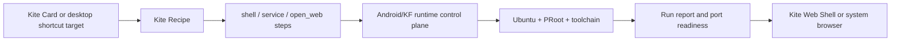

# Kite

<div align="center">

**Android card workbench for KF/KFShell: cards, resources, local Web Shell, and shareable AI workflows on a phone.**

Kite 拿 KF/KFShell 作为移动 Linux 与 AI 运行底座，把“启动工具、等待服务、打开页面、看日志、做账号验证、回到工作台”这些动作卡片化。


</div>

<p align="center">
  
  
  
  
</p>

<p align="center"><sub>Current Android debug build captured on OnePlus 8T: resource catalog, execution preview, recipe editor, and card console.</sub></p>

## What Kite Is

Kite 是一个面向 Android 的 KF/RKF 操作层。它不是另一个完整浏览器，也不是把 KF 重新写一遍；它更像 KF 的手机工作台外壳：

- **KF/KFShell 管执行**：Ubuntu rootfs、PRoot、进程管理、工具链、服务端口、终端、日志和运行时生命周期。
- **Kite 管入口**：卡片、Recipe、资源页、Web Shell、运行报告、导入分享、桌面快捷方式和登录/回调承接。
- **AI 和人都能用**：一个服务或脚本可以变成卡片，点击后启动、等待、打开、诊断，而不是让用户记一串命令和端口。

## Product Surfaces

| Surface | What it does |
| --- | --- |
| **Card Console** | 把服务、命令、网页工作台变成可启动的 Kite Card，并保留运行状态。 |
| **Resource Catalog** | 管 Node.js、Hermes、uv、curl、Git、Python 等本地资源和依赖关系。 |
| **Resource Detail** | 显示安装来源、执行命令、安装位置、访问入口和依赖说明。 |
| **Recipe Editor** | 用 `shell` / `service` / `open_web` 等动作组合一个可分享工作流。 |
| **Kite Web Shell** | 承接 `127.0.0.1` / `localhost` 页面、WebView console、加载错误和本地 AI Web 应用。 |
| **Desktop Shortcuts** | 保留 shortcut/card identity 语义，目标是从 Android 桌面直达对应工作台。 |

## Run Logic

Kite Card 不是静态 UI 数据。它同时是快捷入口、任务身份、运行报告绑定对象、默认工作台地址和分享单元。



典型流程：

1. 用户点击 Kite Card；桌面快捷方式会进入同一条 card identity 路径。
2. Kite 读取 Recipe，建立这次运行的 card identity 和 run report。
3. Android/KF runtime 执行 shell、安装依赖或启动服务。
4. Kite 等待端口、解析输出、记录最后有效状态。
5. 本地页面交给 Kite Web Shell，公网登录或 OAuth 回调交给系统浏览器协作处理。
6. 卡片状态回写到工作台，后续可以继续打开、停止、诊断或分享。

## Core Concepts

### Kite Card

Kite Card 是一个可执行的工作流入口。它可以只是打开一个网址，也可以先执行脚本，再等待服务就绪，最后打开 Web 页面。

常见卡片类型：

- 服务卡片：启动 Hermes WebUI、Codex WebUI、文件服务、Python/Node Web 服务等。
- 安装卡片：一键安装 Android/AI 开发环境、Node、pnpm、uv、adb/fastboot 等依赖。
- 命令卡片：执行一个 KF/Ubuntu 命令，读取结构化运行报告。
- Web 卡片：直接打开本地或外部工作台。

### Kite Recipe

Kite Recipe 是卡片背后的 JSON 工作流协议。一个 Recipe 可以描述：

- 卡片名称、图标、分类和说明。
- 默认打开地址，例如 `http://127.0.0.1:8648`。
- `shell` / `service` / `open_web` 等步骤。
- 成功判断、最后有效输出、运行报告摘要。
- 是否允许作为桌面快捷入口。

Recipe 的执行边界很重要：Recipe 可以描述要做什么，但传输方式、token、KF 启动方式和最终执行权不交给 Recipe 决定。Android/KF runtime 才是执行 shell、PRoot、进程、服务和资源管理动作的控制面。

### Kite Web Shell

Kite Web Shell 是一个偏“无头”的内置浏览器壳。它不追求普通浏览器的完整地址栏、书签、历史、复杂标签页和下载器体验，而是服务本地工作台：

- 打开本地服务页面，例如 `http://127.0.0.1:*` 和 `http://localhost:*`。
- 捕获 WebView console、页面错误、加载状态和能力报告。
- 为本地 AI Web 应用提供稳定的 Android WebView 容器。
- 外部站点和公网登录默认跳系统浏览器。
- 为 Codex、抖音账号、OAuth、CLI 回调等登录/验证流程提供移动端承接点。

长期方向上，Kite Web Shell 会尽量让网页元素、错误、状态和上下文对 AI 更友好，也就是一种更适合 AI 使用和诊断的浏览器工作面。

## Repository Map

这个仓库不是一个纯 UI demo。当前主线包含：

- Android app 工程。
- Kite Console / Recipe 卡片界面。
- Kite Web Shell。
- Kite Bridge Client 和本地运行报告处理。
- Kite Recipe loader、drop zone 导入和共享卡片目录。
- KF/KFShell runtime 相关代码。
- Ubuntu rootfs、PRoot 运行资产、AI 开发工具链离线包。
- Termux terminal view 本地集成。
- Shizuku、ADB、PRoot、runtime lifecycle、task/status/logs 等运行时模块。

主要目录：

| Path | Purpose |
| --- | --- |
| `app/` | Android app, card UI, Web Shell, bridge and KF runtime integration. |
| `app/src/main/assets/recipes/` | Built-in Kite Recipe examples. |
| `assets/` | PRoot, Ubuntu rootfs, resources and toolchain packs. |
| `docs/protocol/` | Kite bridge and Recipe protocol drafts. |
| `docs/architecture/` | Architecture notes for the current v0.x line. |
| `references/` | Local build/deploy toolchain references for this workspace. |

## Sharing And Imports

Kite 预期支持多种卡片来源：

- **Built-in cards**：随 APK 打包，适合官方维护的常用工作流。
- **Local cards**：用户自己创建和编辑。
- **Imported cards**：从共享目录导入。
- **Network-loaded cards**：未来从远端加载。

当前代码中，drop zone 会准备共享目录并扫描 JSON Recipe。复杂卡片可以把脚本逻辑放进包内，Kite 读取 `recipe.json` 后生成卡片，再由 KF runtime 负责执行。

## Build

Windows / PowerShell:

```powershell
.\gradlew.bat assembleDebug
```

Debug APK output:

```text
app/build/outputs/apk/debug/app-debug.apk
```

## Security Boundary

Kite 面向个人设备和本地运行环境，不应该把控制接口暴露给不可信网络。

当前设计原则：

- 本地服务默认绑定 `127.0.0.1` / `localhost`。
- Recipe 不允许决定 bridge 地址、token、KF 包名或传输方式。
- 会触发 shell、PRoot、ADB、进程管理或安装动作的能力必须由 Android/KF 控制面接管。
- 第三方卡片和脚本包需要来源可信，后续应加入更明确的风险提示和签名/权限模型。
- Kite Web Shell 主要承接本地工作台；外部登录和公网链接优先交给系统浏览器。

## License

Kite 原创代码、文档、Recipe 和集成工作默认使用 PolyForm Noncommercial License 1.0.0，个人、研究、教育、非营利等非商业用途可以使用，商业用途需要单独授权。

仓库中包含 Ubuntu、Node.js、pnpm、uv、PRoot、Termux/TerminalView、AndroidX、Shizuku 等第三方组件或二进制资产。这些内容不被 Kite 的不可商用许可证重新授权，仍按各自上游许可证和分发条款使用。详情见 `LICENSE` 和 `THIRD_PARTY_NOTICES.md`。
